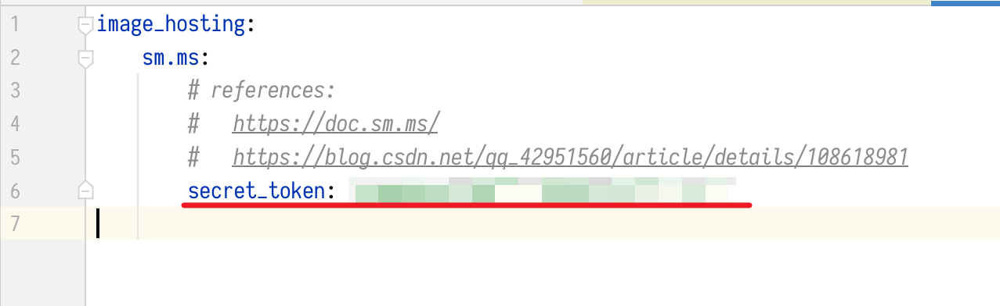
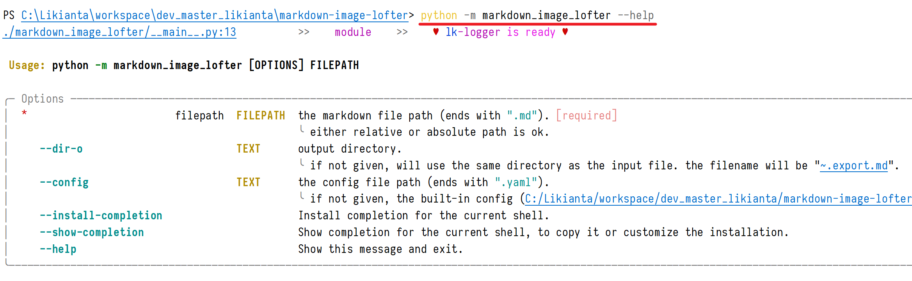

# Markdown Image Lofter

## Workflow

1.  Write markdown, embed local image files.
2.  Use this tool to upload images (to sm.ms image hosting):

    1.  You must have a sm.ms account, get a secret api token and save it in [config.yaml](./config.yaml).

        Like below:

        

    2.  Run in terminal:

        ```shell
        python -m markdown_image_lofter <path/to/markdown>
        ```

        or get help with:

        ```shell
        python -m markdown_image_lofter -h
        ```

        

3.  After process is done, you get a new markdown file (the same origin name but with a different extension: '.export.md').

4.  Now you can publish it to your blog.
